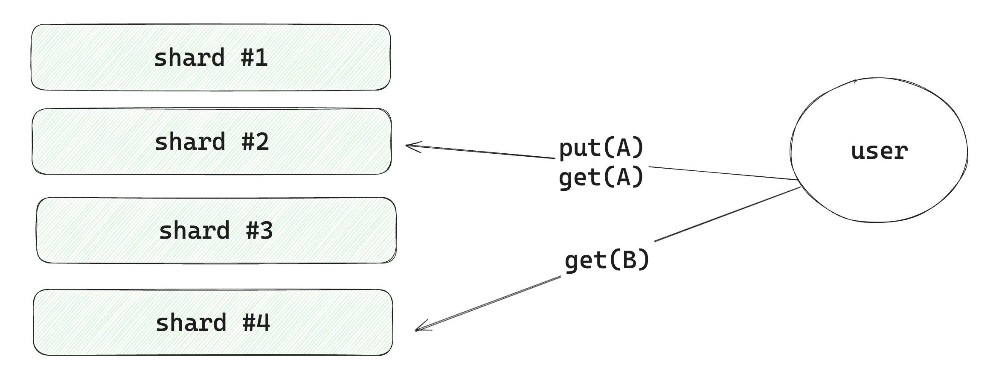
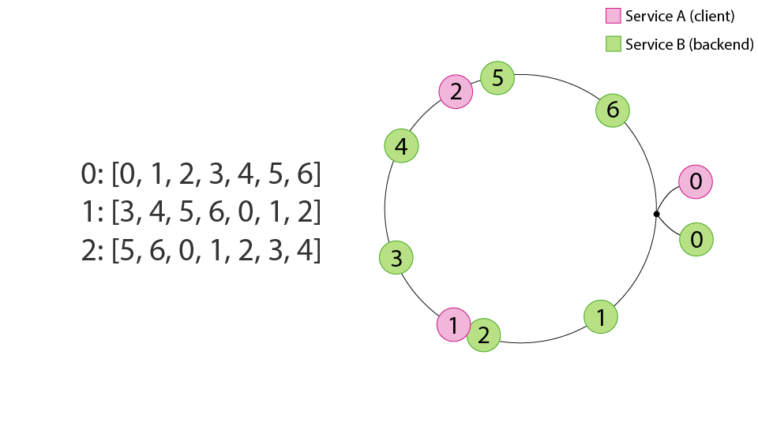

# Балансировка трафика и шардирование

В рамках данного материала предлагается ознакомиться с двумя важными принципами распределения нагрузки:
- Балансировка трафика между stateless приложениями (серверами)
- Шардирование данных

## Балансировка трафика

Балансировщик трафика используется для распределения входящего трафика между несколькими серверами. 
Это позволяет равномерно распределять нагрузку, предотвращая перегрузку отдельных серверов и 
повышая общую производительность системы.

Балансировщик (balancer) &mdash; специальная программа (или аппаратное устройство), 
которое распределяет нагрузку между несколькими серверами. Его задачей является принять входящий запрос
и отправить его на один из доступных серверов.

Выделяют следующие основные алгоритмы балансировки нагрузки:
- Round robin &mdash; балансировка по кругу, где каждый запрос отправляется на следующий сервер в списке.

- Random &mdash; каждый раз выбирается случайный сервер (возможны выбросы в связи с неидеальностью рандома).

- Least connections &mdash; балансер в фоне синхронизирует состояние всех серверов и выбирает тот, у 
    которого меньше всего активных соединений. Предполагается, что чем меньше у сервера активных 
    соединений (или очередь запросов), тем быстрее он сможет обработать новый запрос.

- Power of 2 choices &mdash; выбирает два случайных сервера, и выбирает сервер с наименьшей очередью (числом соединений).
    Более стабильная версия Least connections.

- IP hashing &mdash; запросы от одного и того же клиента всегда направляются на один и тот же сервер. 

- Consistent hash ring &mdash; консистентное хеширование, которое также зачастую используется в шардировании. 
  [Подробнее про одну из реализаций](https://static.googleusercontent.com/media/research.google.com/en//pubs/archive/44824.pdf).

В зависимости от задачи и требований к системе могут использоваться различные алгоритмы балансировки.
Сравнить работу разных алгоритмов можно в рамках лабораторной работы [load-balancing-lab](./load-balancing-lab/).

В популярных прокси (nginx, envoy, haproxy) многие из описанных алгоритмов уже реализованы,
остаётся только выбрать более подходящий. С примерами конфигурации nginx можно ознакомиться в примере
[nginx-balancing](./nginx-balancing/).

## Шардирование

Шардирование решает задачу распределения данных по серверам и применяется в следующих случаях:
- Один сервер не способен вместить на себя все данные.
- Один сервер не способен обработать всю нагрузку на запись (операций записи слишком много).

Шардирование позволяет распределить данные по нескольким серверам, каждый из которых отвечает 
за определенную часть данных.

Главная идея &mdash; придумать алгоритм, который детерминированно будет вычислять, на каком из 
серверов находятся данные.

С реализацией подхода шардирования можно ознакомиться в примере [kv](./kv/).

### hash(key) % N

Простой подход: для ключа вычислить хеш и взять остаток от деления на количество шардов: 
`shard_id = hash(key) % num_shards`. 
Такой подход позволяет распределять данные равномерно, но при добавлении или удалении шарда 
потребуется мигрировать большую часть данных.

С простой реализацией данного алгоритма можно ознакомиться в [simple-sharding](./simple-sharding/readme.md).

### Consistent hash ring

Более сложный подход: использовать consistent hashing, который позволяет упростить процедуру изменения
числа шардов. Предлагается выделить пространство от 0 до M (большое число) и закольцевать его.
На этом кольце расположить имеющиеся сервера, посчитав хеш от каждого из них (например, от IP сервера).
Чтобы понять, на каком сервере хранятся данные, необходимо вычислить хеш ключа и обратиться к 
ближайшему серверу на "кольце" по часовой стрелке.

*[Источник](https://medium.com/@kewei.train/deterministic-aperture-algorithm-%E7%AD%86%E8%A8%98-3a3bbb5e30e2)*

В случае Consistent hash ring при изменении числа узлов, необходимо мигрировать только небольшую часть данных,
за которую был ответственен удаляемый шард.

Данная схема шардирования применяется в хранилищах Dynamo и Cassandra.

## Полезные материалы

- [Предыдущая версия семинара по балансировке нагрузки (подробный текст)](./balancing-old/)
- [Оригинальная статья про балансер Твиттера](https://blog.twitter.com/engineering/en_us/topics/infrastructure/2019/daperture-load-balancer.html)
- [Описание алгоритмов балансировки в envoy proxy](https://www.envoyproxy.io/docs/envoy/latest/intro/arch_overview/upstream/load_balancing/load_balancers)
- [Load Balancing in the Datacenter](https://sre.google/sre-book/load-balancing-datacenter/)
- [Power of 2 choices](https://www.eecs.harvard.edu/~michaelm/postscripts/mythesis.pdf)
- [Test Driving “Power of Two Random Choices” Load Balancing](https://www.haproxy.com/blog/power-of-two-load-balancing/)
- [A Guide to Consistent Hashing](https://www.toptal.com/big-data/consistent-hashing)
- [Consistent hashing](http://michaelnielsen.org/blog/consistent-hashing/)
- [Consistent Hashing: Algorithmic Tradeoffs](https://dgryski.medium.com/consistent-hashing-algorithmic-tradeoffs-ef6b8e2fcae8)
- [Sharding with consistent hashing](https://blog.yugabyte.com/four-data-sharding-strategies-we-analyzed-in-building-a-distributed-sql-database/) и [cassandra partitioning (секция 5)](https://www.cs.cornell.edu/projects/ladis2009/papers/lakshman-ladis2009.pdf)
