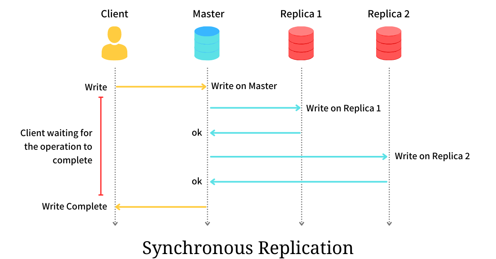
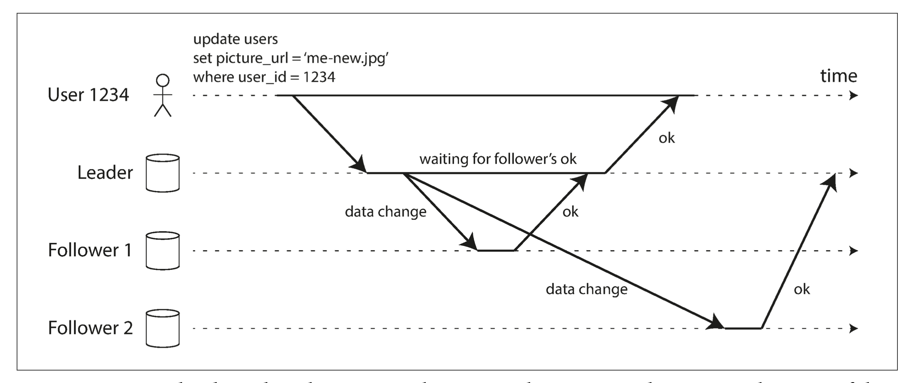
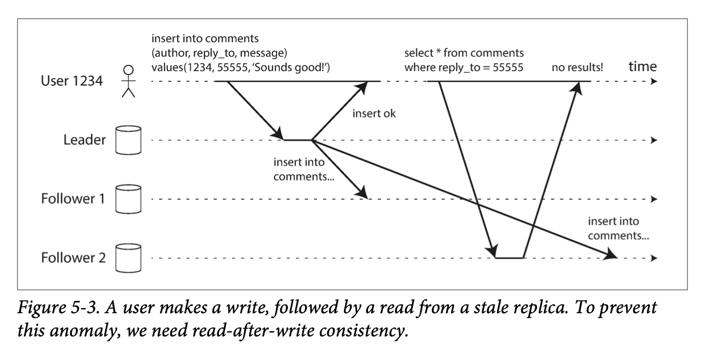
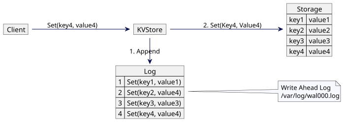
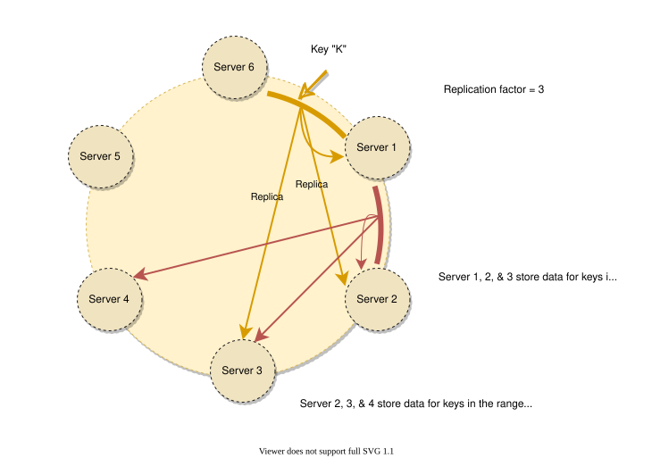
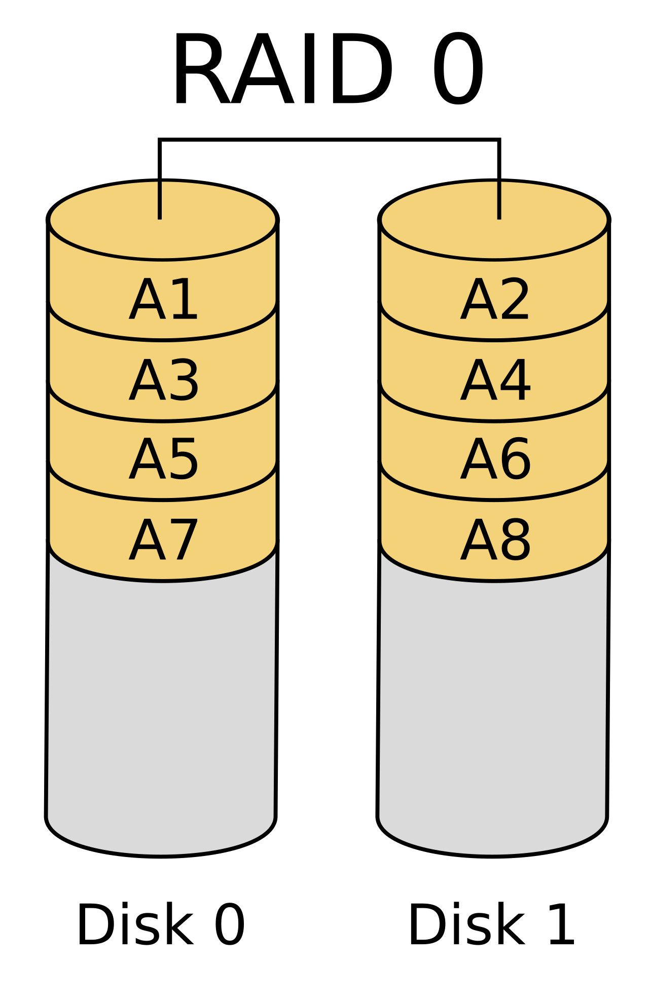
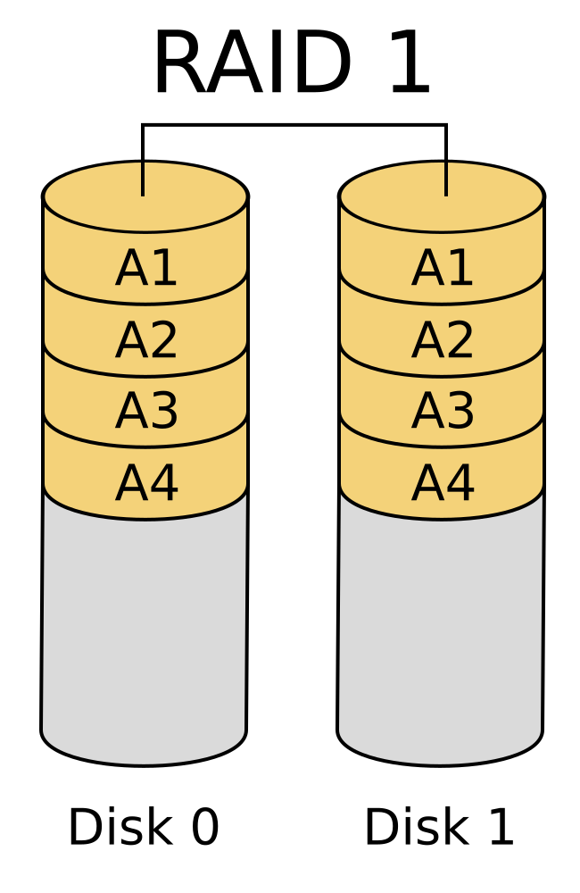
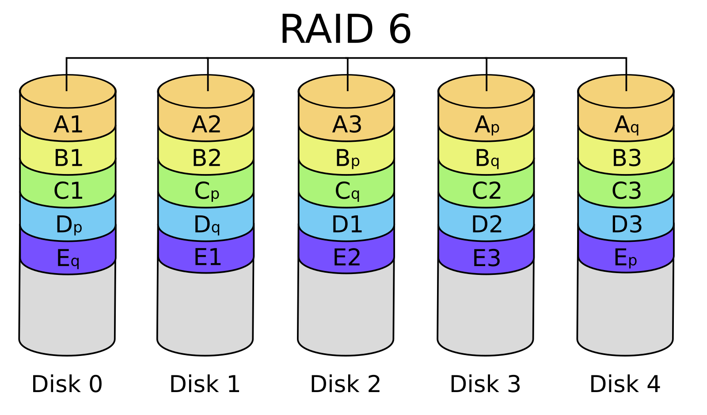
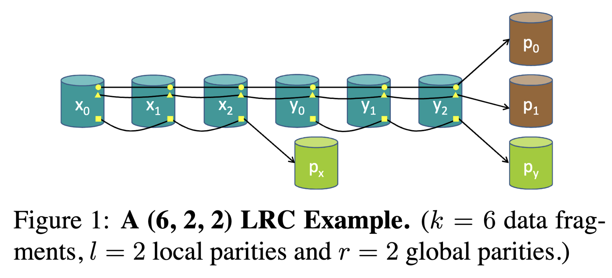

# Семинар 9: Репликация

В рамках данного семинара предлагается разобраться с концепцией репликации данных.
Идея простая &mdash; иногда вместо одного сервера необходимо завести его "реплики" (или копии), 
где будет лежать одна и та же информация.

Это позволяет добиться:
- Отказоустойчивость и сохранность данных &mdash; при отказе одного из серверов, данные можно получить с другого сервера.
- Увеличение производительности &mdash; если один сервер не справляется с обработкой всех запросов на чтение.
- Уменьшение latency &mdash; расположить сервера-реплики ближе к клиентам (пример &mdash; CDN).

## Репликация в СУБД

Как правило в существующих хранилищах (СУБД) репликация уже реализована и используется повсеместно.

Как правило выделяется узел, который принимает запросы от пользователя на запись. Далее этот узел должен
отправить запрос на запись в остальные узлы (реплики).

### Sync and async replication

Подход, когда есть один узел, принимающий запросы на запись и реплицирующий данные на другие реплики,
называется leader-follower (ранее известный как master-slave).

*[Источник](https://arpitbhayani.me/blogs/replication-strategies/)*

Выделяют два вида репликации по принципу "когда клиент получает ответ на запрос записи":
- **Синхронная репликация** &mdash; данные сразу дублируются на все реплики, и только после 
  подтверждения записи на других репликах, клиент получает ответ об успешной записи. 
  Это позволяет избежать потери данных при отказе узла, который производит запись, но сложнее 
  в реализации и увеличивает latency ответа клиенту.
- **Асинхронная репликация** &mdash; клиент получает ответ сразу после успешной записи на узел, который
    изначально принял запрос пользователя. Данные на реплики дублируются в фоновой операции.

Возможна комбинация данных режимов: например, одна sync-реплика и несколько async-реплик:

*Источник: Martin Kleppmann, Designing Data-Intensive Applications*

Асинхронный режим репликации проще в реализации, уменьшает latency ответа клиенту, 
но может привести к потере данных (лидер не успел отправить всю информацию на реплики).

Также в async-репликации возможны так называемые stale чтения (чтение возвращает не самую актуальную информацию):

*Источник: Martin Kleppmann, Designing Data-Intensive Applications*

### Что реплицировать

Возникает вопрос, а что именно необходимо реплицировать.

**Репликация запросов**. Лидер, приняв запрос от клиента, выполняет аналогичный запрос на всех репликах, 
а затем возвращает ответ клиенту. Вариант прост для реализации и довольно экономный, однако возможны трудности 
с недетерминированными запросами. Если запрос полагается на вызов rand(), это значение на каждом из 
узлов может быть разным, что приведет к расхождению данных.

**Row-based репликация**. Если представить, что наша модель данных может быть представлена в виде таблицы
(например, таблицы из пар ключ-значение), то можно реплицировать все изменения строк в данной таблице.
Таким образом мы не будем страдать от недетерминированных запросов, так как предварительно лидер применяет
все изменения к своему состоянию и только потом отправляет измененные значения строк. Однако в случае
массовых операций обновления (PUT *=NULL) потребуется передавать довольно много информации.

**Репликация файловой системы**. Можно реплицировать файловую систему. При вызове системного вызова
write(offset, "data") этот запрос проксируется на все реплики, и каждая из них выполняет запись в 
свою локальную файловую систему. Реализация возможна на уровне операционной системы, однако в таком
подходе необходимо следить за совместимостью версий операционной системы и файловой системы, что не всегда
возможно.

Идеального подхода к репликации не существует; необходимо выбирать его из решаемой задачи и имеющихся
ограничений.

В современных СУБД часто применяется подход с репликацией WAL (write ahead log).
WAL это специальный журнал, в который СУБД фиксирует все изменения данных перед тем, 
как применить их к основной памяти или на диск. И задача репликации сводится к репликации этого
журнала. Такой подход позволяет избежать проблем с совместимостью версий и упрощает реализацию репликации.

*[Источник](https://martinfowler.com/articles/patterns-of-distributed-systems/write-ahead-log.html)*

### Кворумная репликация

Дожидаться подтверждения операции от всех реплик может быть накладно, однако хочется недопустить потери значения.
В таких условиях возникла идмея кворумной репликации.

[Кворум](https://en.wikipedia.org/wiki/Quorum_(distributed_computing)) &mdash; это минимальное 
количество подтверждений, которое необходимо получить для того, чтобы считать операцию выполненной.

Допустим, мы хотим реплицировать данные на три реплики. При получении запроса будем отправлять запросы
на запись на все три реплики, но дожидаться ответа будем только от двух реплик (от тех, что выполнили
операцию быстрее). Если ответ получен от двух реплик, то считаем операцию выполненной.

Внимательный слушатель заметит, что при такой реализации запрос на чтение может вернуть неактуальные данные, 
если одна из реплик еще не успела применить обновления. Чтобы решить эту проблему, предлагается
отправлять запросы на чтение на все реплики, дожидаться ответа от двух самых быстрых реплик и выбирать
наиболее актуальную версию значения из полученных (тему версионирования затронем далее в курсе).

В таком случае нам неважно, какие реплики подтвердили запись и ответили на операцию чтения. 
Так как на операцию записи и чтения мы обращались на две реплики, как бы мы не выбрали эти множества
реплик, они обязательно пересекутся как минимум по одной реплике. Эта реплика будет содержать
наиболее актуальные данные.

Если обобщить задачу на произвольное число реплик N, то для кворума необходимо выбрать числа R и W.
R &mdash; число реплик, от которых мы ждем ответа на операцию чтения, W &mdash; число реплик, 
которые должны подтвердить операцию записи. Чтобы система возвращала актуальные значения, должно 
выполняться условие `R + W > N`. В зависимости от отношения и сложности операций чтения и записи
можно выбирать наиболее подходящие R и W для вашей системы.

Реализацию этой идеи можно увидеть в СУБД Cassandra 
(и почитать в paper'e о Dynamo, секция 4, sloppy quorum & hinted handoff).

*[Источник](https://www.designgurus.io/course-play/grokking-the-advanced-system-design-interview/doc/replication)*

С простой реализацией кворумной репликации можно ознакомиться в реализации из 
[kv week-08](../../week-08/seminar/kv/) (`mode: replication-quorum`).

## RAID

[RAID](https://en.wikipedia.org/wiki/Standard_RAID_levels) (redundant array of inexpensive disks)
&mdash; переносит идею репликации данных из распределенной системы на уровень одного компьютера.

Оказывается, к одному серверу можно подключить сразу несколько дисков с целью увеличения скорости доступа
и надежности сохранности (пережить отказ диска).

Первая простая идея &mdash; поставить два диска рядом, писать половину данных на первый диск, 
вторую половину &mdash; на второй. Надежность не увеличивается, но зато увеличивается вместительность 
и скорость доступа. Такой подход называется RAID 0:

Вторая простая идея &mdash; это использовать несколько дисков для хранения одного и того же файла 
(или блока данных). Это называют RAID 1:

Можно также обратиться к теории алгебры и вспомнить коды Хэмминга и коды Рида-Соломона, которые
позволяют детектировать ошибки в записи и хранении данных. На N полезных байт можно завести дополнительные
K байт для исправления ошибок. Такой подход называется RAID 6 (используются коды Рида-Соломона):

Не погружаясь в детали алгебру, идею восстанавливающих кодов можно понять на примере операции XOR.
Допустим есть две половины данных: A и B. Давайте посчитаем `C = A ^ B`. Распределим эти три блока по
трём дискам. Тогда при потере одного из дисков мы всегда можем обратиться к оставшимся двум и восстановить
данные с помощью великолепного свойства операции XOR: `A = C ^ B`.

## Erasure coding

Подход с RAID-массивами можно обратно перенести на уровень приложений в распределенных системах.

Стандартная репликация данных как правило влечет большой расход дискового пространства: приходится
хранить на 200% больше данных, чем нужно.

Подход Erasure coding предлагает использовать коды коррекции ошибок на уровне репликации хранилищ.
При записи очередного блока данных необходимо распределить этот блок и его parity-блоки (чексуммы)
на несколько других реплик. Тем самым мы сможем добиться меньшего дублирования данных и по-прежнему
уметь переживать отказы небольшого числа узлов.

Этим свойством пользуются при реализации хранилищ, которые должны работать в рамках большого кластера
(сотни и тысячи узлов).

При реализации данного подхода часто обращаются к алгоритму 
[Erasure Coding in Windows Azure Storage](https://www.microsoft.com/en-us/research/wp-content/uploads/2016/02/LRC12-cheng20webpage.pdf).

## Полезные материалы

- [Текст предыдущей версии семинара про репликацию](./old-replication/)
- [Видео](https://youtu.be/gkg-FAEXIkY) и [вики-страница](https://en.wikipedia.org/wiki/CAP_theorem) о CAP-теореме
- [Критика CAP-теоремы](https://jvns.ca/blog/2016/11/19/a-critique-of-the-cap-theorem/)
- [Описание режимов репликации в Postgres](https://www.postgresql.org/docs/current/different-replication-solutions.html)
- [Кворумная репликация в Dynamo](https://www.allthingsdistributed.com/files/amazon-dynamo-sosp2007.pdf) (секция 4)
- Коды коррекции: [код Хэмминга](https://en.wikipedia.org/wiki/Hamming_code) и [коды Рида-Соломона](https://en.wikipedia.org/wiki/Reed%E2%80%93Solomon_error_correction)
- [Понятное описание различных RAID-стандартов](https://en.wikipedia.org/wiki/Standard_RAID_levels)
- [Особенности устройства и обращения с HDD и как выбирать длину блока](https://ioflood.com/blog/optimal-raid-stripe-size-and-filesystem-readahead-for-raid-10/#:~:text=In%20modern%20operating%20systems%2C%20the,raid%20cards%20default%20stripe%20size)
- [How RAID-6 dual parity calculation works](https://igoro.com/archive/how-raid-6-dual-parity-calculation-works/)
- [Описание Erasure coding в версии семинара 2018](https://github.com/osukhoroslov/distsys-course-hse/tree/2020/seminars/08-scalability#erasure-coding)
- [Алгоритм Erasure Coding в Windows Azure Storage](https://www.microsoft.com/en-us/research/wp-content/uploads/2016/02/LRC12-cheng20webpage.pdf)
